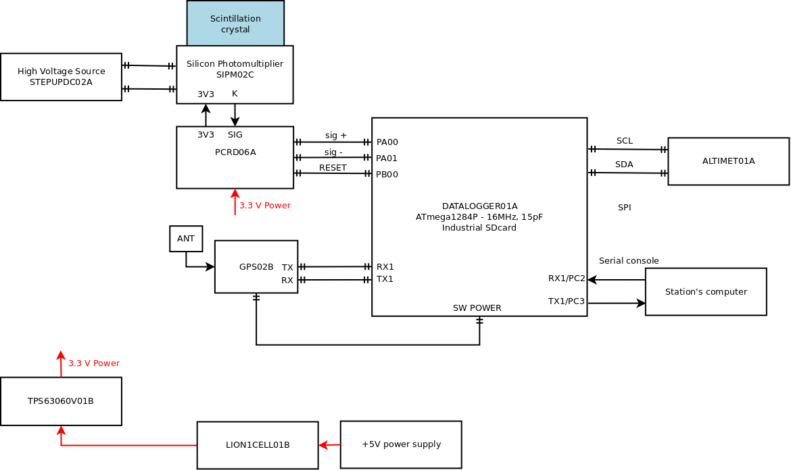

# GEODOS02C - Ionizing radiation detector for research stations

GEODOS02, also called “CARDOS”, is an adjusted version of scintillation detectors based on GEODOS01 developed previously. The new device is primarily designed for mobile measurements using cars. However, thanks to their construction and characteristics they can be used for other applications as well. The specific feature of CARDOS detectors is that they do not contain any recording medium, Internet of Things data link LoRa, or a time source. Using the detector, therefore, requires connecting it to a recording device (usually a station's computer) that has access to an accurate time and is able to create a record from a USB data stream. The location of the measuring car is logged using a GNSS receiver connected to the same computer.

If you need a fully automatic ionising radiation dosimeter-spectrometer device (with an internal logging and a backup power supply) or device designed for outdoor use without the possibility of connecting to power supply and data network [GEODOS01](https://github.com/UniversalScientificTechnologies/GEODOS01) might be a better option. We can help you in choosing the most suitable device or even design and develop a new one according to you requirements. In either case, reach us using email [support@ust.cz](mailto:support@ust.cz).

### Locations

#### Gamma spectrometer for measuring cars for thunderstorm chasing

GEODOS02 can be used for monitoring the intensity of ionizing radiation over large areas. An example of using the CARDOS scintillation detectors include measurements with research cars for CRREAT project, dealing with research into high-energy phenomena in the atmosphere.

#### Lomnicky Stit observatory

### Technical parameters

* Detection element: scintillation crystal NaI(Tl) 10 mm in diameter, 20 mm in length, integrated with SiPM detector
* Optional backup power source: rechargeable 18650 Li-ion cell
* Record’s content: energy and time of each event above the specified energy (1MeV by default)
* Record’s periodicity: 10 s (maximal dead time 2 s)
* Time resolution: 20 us
* ADC Conversion time: 104 us
* [Dead time](https://en.wikipedia.org/wiki/Dead_time): 2 us
* Accuracy of event’s time: 500 ns
* Energy range: 0.3 to 1 MeV (0,2 MeV resolution). The range could be increased up to 40 MeV by component values selection.
* Open-source HW and SW
* Device status indicator type: LED
* Operational temperature range: -20°C to +35°C
* Charging temperature range: 0°C to +45°C (the internal backup Li-ion cell is not recharged outside of this range )

### Device block diagram

### Sensor element

The core of the detector is a scintillation crystal with [SiPM detector](https://en.wikipedia.org/wiki/Silicon_photomultiplier).

### Data storage

### Detailed documentation of the used electronic modules

* [STEPUPDC02A](https://github.com/mlab-modules/STEPUPDC02)
* [SIPM02C](https://github.com/mlab-modules/SIPM02) known as "AIRDOSC01A_PCB01C"
* [PCRD06A](https://github.com/mlab-modules/PCRD06)
* [GPS01B](https://www.mlab.cz/module/GPS01B)
* [DATALOGGER01A](http://mlab.cz/module/DATALOGGER01A)
* [ALTIMET01A](https://github.com/mlab-modules/ALTIMET01)
* [TPS63060V01A](https://github.com/mlab-modules/TPS63060V01)
* [LION1CELL01B](https://github.com/mlab-modules/LION1CELL01)
